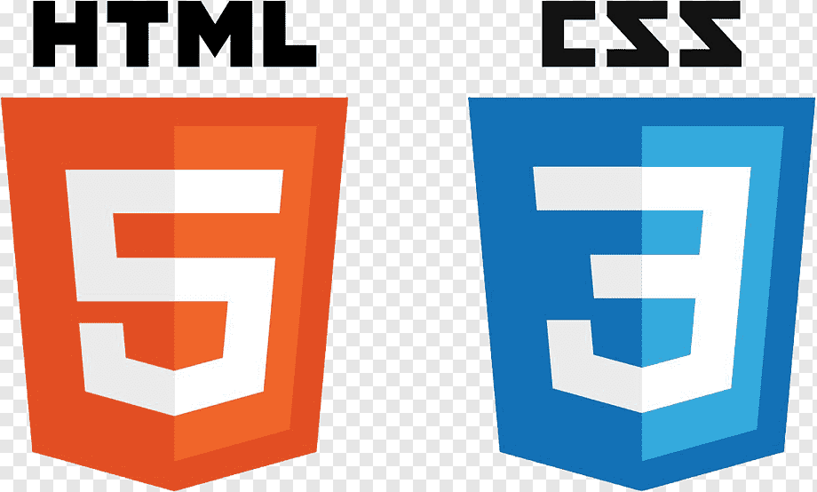

### Всем привет! 👋

Меня зовут Ирина. Я - начинающий frontend-разработчик. Я недавно закончила учиться в Яндекс.Практикуме на факультете Web-разработки. И хочу развиваться дальше в этой профессии!

### Мой стек:

### Со мной можно связаться:
> по email: irinamashkina@list.ru
> по tg: https://t.me/IraMashkina
